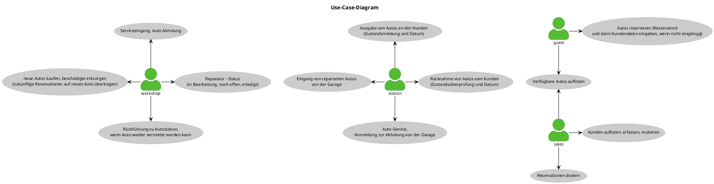
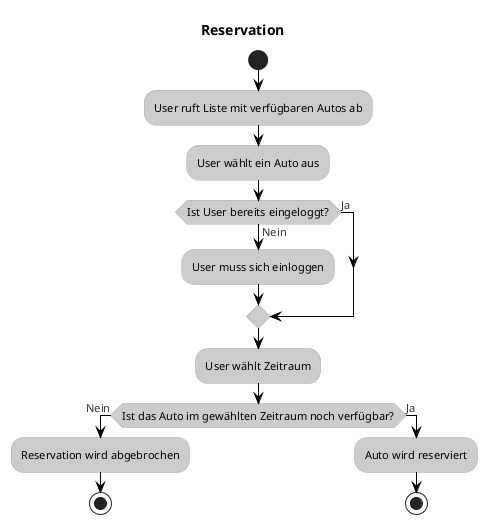

# Diagrams

## Use-Case

```plantuml
@startuml use-case

!theme reddress-lightgreen
title Use-Case-Diagram

skinparam actorStyle awesome

:guest: -d-> (list)
:guest: -r-> (reservation)

:sales: -u-> (list)
:sales: -r-> (manage-customers)
:sales: --> (edit-reservations)

:station: -u-> (distribute)
:station: -r-> (collect)
:station: -d-> (service-registration)
:station: -l-> (service-collection)

:workshop: -u-> (service-pickup)
:workshop: -r-> (service)
:workshop: -d-> (service-return)
:workshop: -l-> (manage-cars)

(list) as "Verfügbare Autos auflisten"
(reservation) as "Autos reservieren (Reservation)\nund dann Kundendaten eingeben, wenn nicht eingeloggt"
(manage-customers) as "Kunden auflisten, erfassen, mutieren"
(edit-reservations) as "Reservationen ändern"
(distribute) as "Ausgabe von Autos an den Kunden\n(Zustandsmeldung und Datum)"
(collect) as "Rücknahme von Autos vom Kunden\n(Zustandsüberprüfung und Datum)"
(service-registration) as "Auto-Service,\nAnmeldung zur Abholung von der Garage"
(service-collection) as "Eingang von reparierten Autos\nvon der Garage"
(service-pickup) as "Serviceeingang, Auto Abholung"
(service) as "Reparatur - Status\n(in Bearbeitung, noch offen, erledigt)"
(service-return) as "Rückführung zu Autostation,\nwenn Auto wieder vermietet werden kann"
(manage-cars) as "neue Autos kaufen, beschädigte entsorgen\n(zukünftige Reservationen auf neues Auto übertragen)"

@enduml
```

## Activity-Diagram (Reservation)

```plantuml
@startuml reservation

!theme reddress-lightgreen

title Reservation

start
:User ruft Liste mit verfügbaren Autos ab;

:User wählt ein Auto aus;

if (Ist User bereits eingeloggt?) then (Nein)
    :User muss sich einloggen;
else (Ja)
endif

:User wählt Zeitraum;

if (Ist das Auto im gewählten Zeitraum noch verfügbar?) then (Nein)
    :Reservation wird abgebrochen;
    stop
else (Ja)

:Auto wird reserviert;
stop

@enduml
```
